# KATHA ART SYSTEM
# COMPLETE SYSTEM FLOW

> **Repository verification note:** The repository implements an Ionic/Angular personal productivity application displayed as **TIMESYNC**, not a Laravel art system. No nested `katha-art-system/` application is present. This flow documents only the routes, screens, actions, and local-storage behavior that can be traced in the checked-out source. The intended relationship to “Katha Art System” is **Not verified from the repository.**

## 1. Overall User Flow

1. **Start:** The person opens the web or mobile application.
2. The empty route redirects to **Home**. There is no login or role check.
3. Home loads tasks and Pomodoro sessions from the current browser/device local storage. If no task data has ever been saved, two built-in sample tasks are shown in memory.
4. The person can review the dashboard, change the temporary Home feeling selection, act on today's tasks, or open Tasks, Pomodoro, or Analytics.
5. Task changes are saved to local storage and immediately update subscribed screens.
6. Analytics reads task, Pomodoro-session, and mood data from local storage and calculates the selected range.
7. Mood actions on Analytics add or clear local mood entries.
8. The timer runs in memory and is shared between its normal and fullscreen views. It is not connected to Pomodoro-session storage.
9. The person continues to another module or closes the application. There is no logout flow.

## 2. Overall System Flowchart

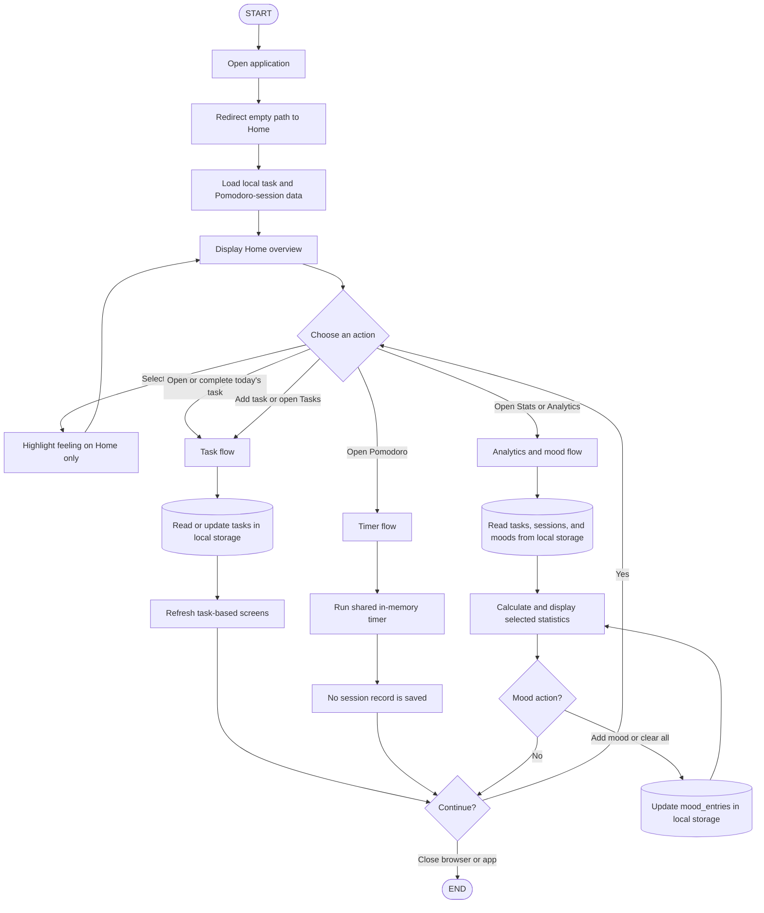

## 3. Entry and Navigation Flow

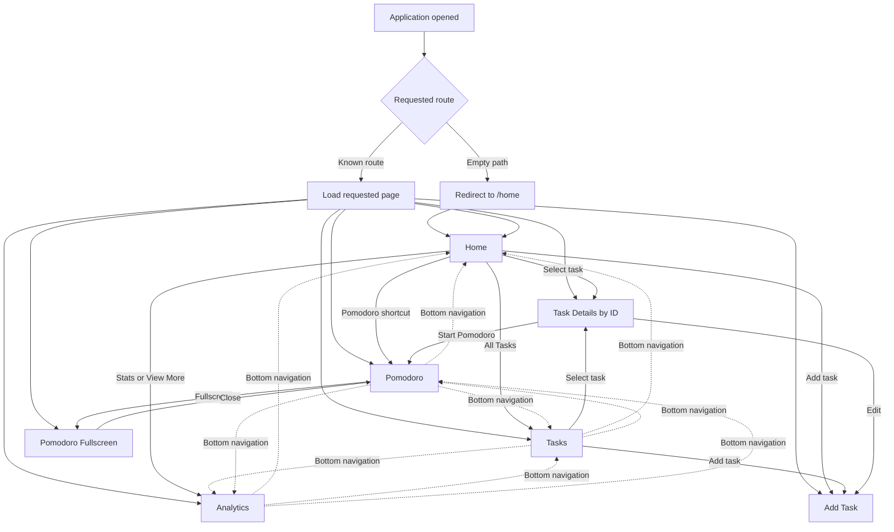

### Route behavior and exceptions

- Task Details requires an ID. If the ID is missing or is not found in the currently loaded tasks, the application navigates to Tasks.
- `/tabs/tasks` and `/tabs/pomodoro` are compatibility paths that redirect to Tasks and Pomodoro.
- No catch-all “page not found” route is implemented.
- No route is protected by authentication or authorization.
- The Profile component is not registered as a route and is not part of the reachable navigation flow.

## 4. Task Management Flow

### 4.1 Initial task loading

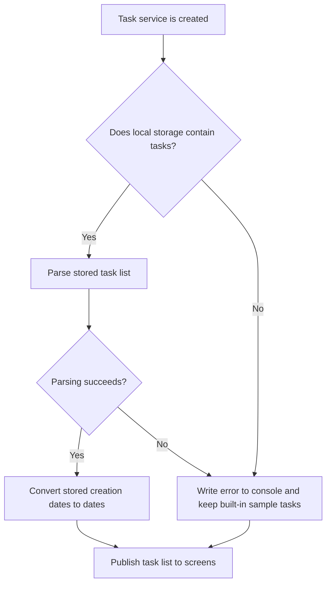

Two sample tasks are the initial in-memory list when no usable saved task list exists: **Complete Project Proposal** and **Study for exam**. They are not written to local storage until a task-changing operation saves the list.

### 4.2 Add task flow

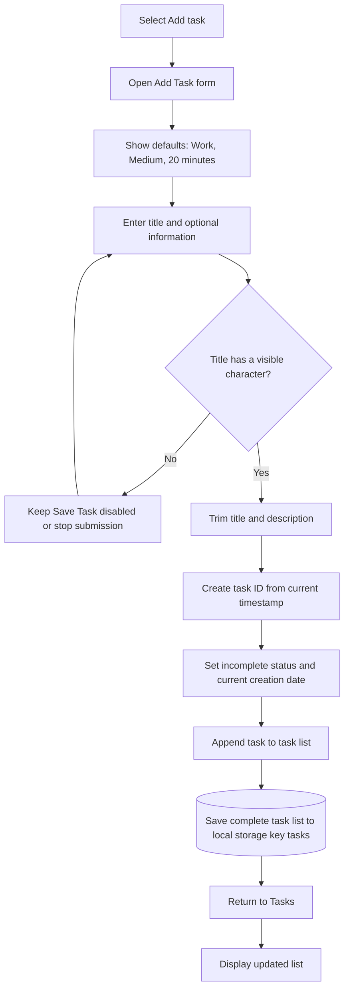

No due date or due time is collected. Estimated time uses 20 when its submitted value is absent or otherwise evaluates as zero.

### 4.3 View, filter, and complete task flow

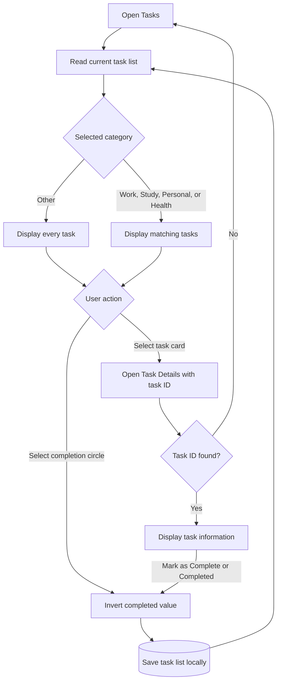

The Tasks page's **Other** selection is implemented as “show all”; it does not filter to only Other-category tasks.

### 4.4 Edit task flow

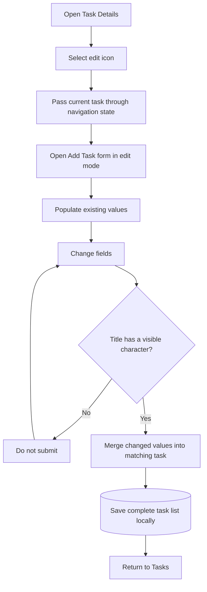

### 4.5 Delete task flow

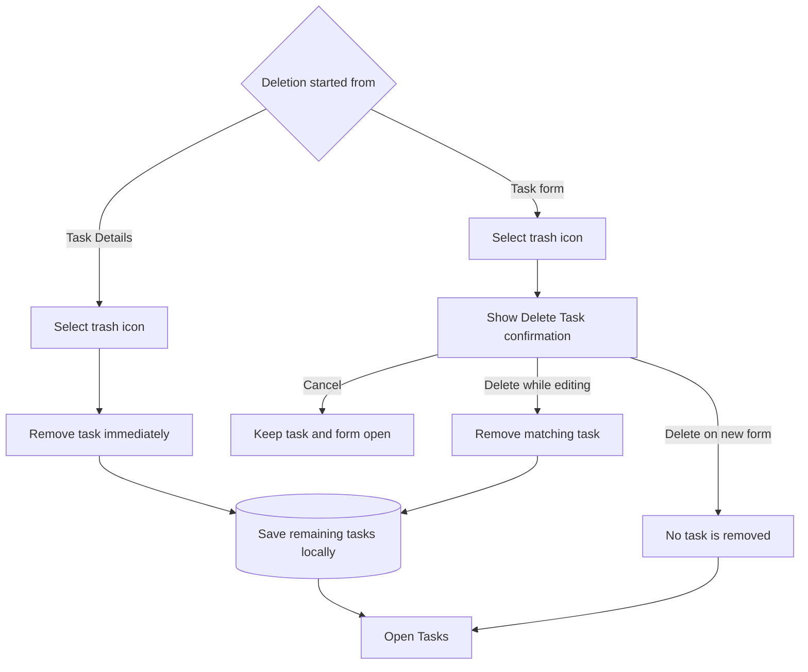

## 5. Home Dashboard Flow

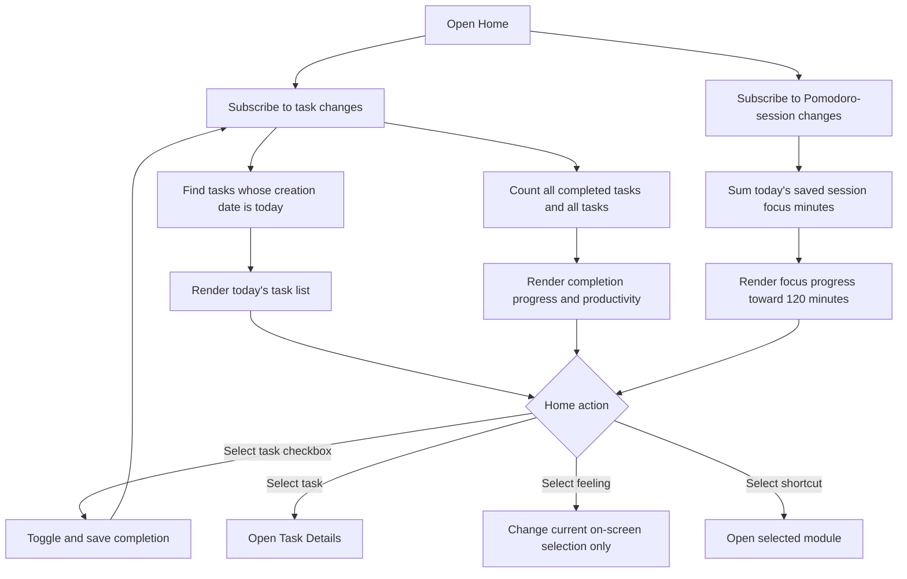

Home productivity is completed tasks divided by all tasks, capped between 0% and 100%. Its “Weekly Overview” uses these current totals; it does not calculate a separate week range.

## 6. Pomodoro Timer Flow

### 6.1 Normal timer

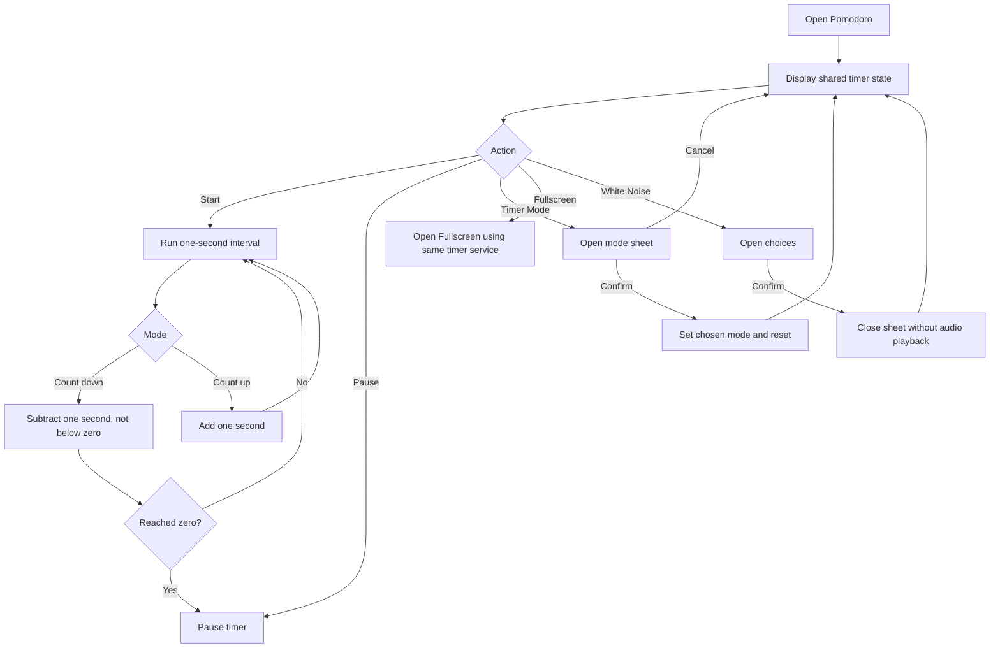

### 6.2 Fullscreen timer

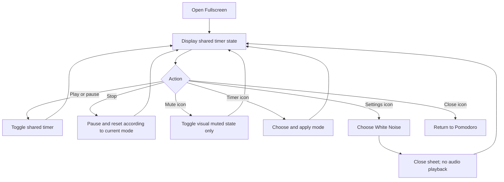

### 6.3 Focus-record limitation

The timer service changes elapsed seconds only. Neither timer page calls the Pomodoro service's session-creation operation when time reaches zero or the user stops. Therefore:

```text
Timer runs or ends
→ No Pomodoro session is created
→ No pomodoro_sessions local-storage update occurs
→ Home and Analytics focus totals do not increase
```

## 7. Analytics Flow

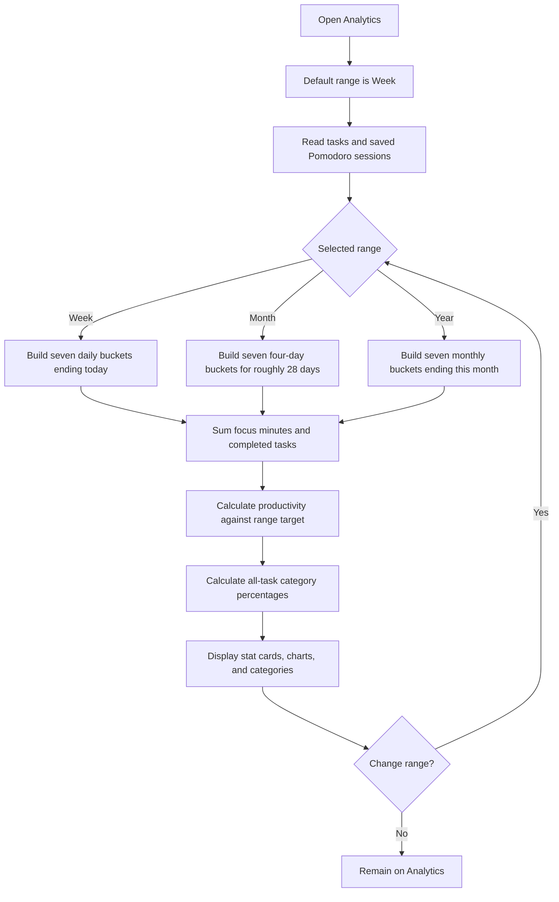

### Calculation rules

- **Week:** today and the preceding six days.
- **Month:** sessions/tasks no more than 28 calculated days old, put into seven buckets by age. Labels are W1 through W7.
- **Year:** the current month and preceding six months.
- **Focus Minutes:** sum of `focusTime` in saved sessions in the selected buckets.
- **Tasks Completed:** number of completed tasks whose creation date is in the selected buckets.
- **Productivity:** completed-task total divided by 10 (Week), 40 (Month), or 480 (Year), multiplied by 100 and capped at 100%.
- **Task Categories:** each displayed category count divided by all tasks. Displayed categories are Work, Study, Personal, and Health; Other contributes to the denominator but has no displayed row.

There is no export or downloadable report flow.

## 8. Mood Tracking Flow

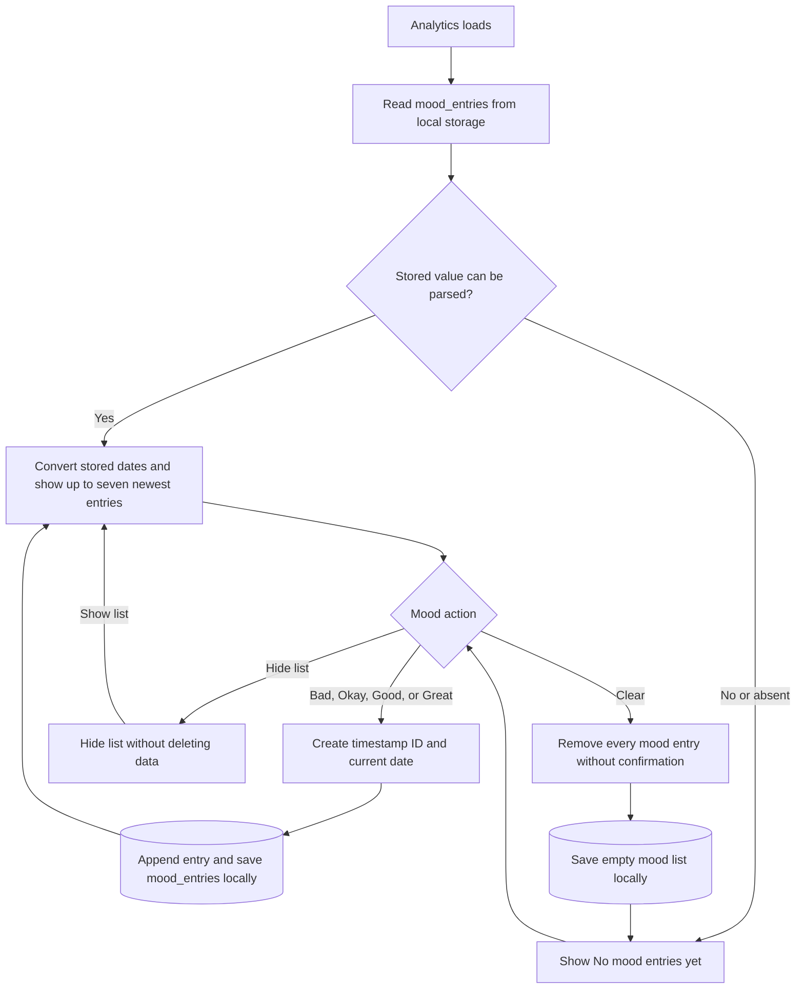

The feeling buttons on Home are a separate visual control and never enter this mood flow.

## 9. Data Flow Summary

| User-visible data | Source | User actions that update it | Persistence |
|---|---|---|---|
| Tasks | Task service | Add, edit, completion toggle, delete | Local storage key `tasks` |
| Analytics moods | Mood service | Select mood, Clear all | Local storage key `mood_entries` |
| Timer value and mode | Timer service | Start, pause, stop/reset, change mode | Memory only; shared between normal and Fullscreen while the service exists |
| White Noise choice | Pomodoro page instance | Select an option and confirm | Page memory only; no sound implementation |
| Home feeling | Home page instance | Select Bad, Okay, Good, or Great | Page memory only |
| Pomodoro sessions | Pomodoro service | No connected user-facing action | Reads/writes local storage key `pomodoro_sessions`, but the UI does not create records |

## 10. Authentication, Roles, Profile, Notifications, Uploads, and Reports

These flows were checked because they are commonly present in the requested system, but they are not implemented here:

- **Authentication:** no login, registration, password, or session flow.
- **Roles:** no roles, permissions, guards, or role redirects.
- **Profile:** a static component exists but has no route and no working account actions.
- **Logout:** no authenticated session and no logout action.
- **Notifications:** no notification workflow. The word “Notifications” appears only in the unreachable static Profile design.
- **Uploads:** no image or file selection/upload workflow.
- **Search/sort/pagination:** none; only task category filtering is implemented.
- **Report export:** none; Analytics is on-screen only.
- **Server/database operations:** none found. User data flows to browser/device local storage rather than a database.

Any intended Katha art-specific process, user role, artwork workflow, database, or Laravel behavior is **Not verified from the repository.**
